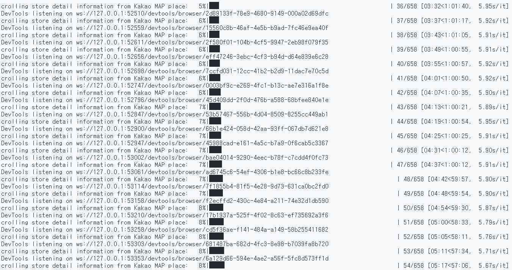
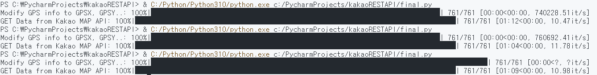
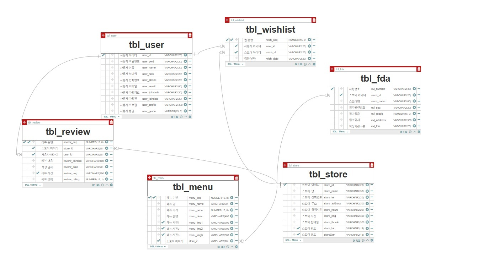

# WeSeek App을 위한 DB 생성 및 crolling Script

> 작성자 : 하승권, 이호준

> 작성일자 : 2022-09-01

## 1. Script구성

`test.db` : 식약청으로부터 전달받은 Data를 저장하는 최초의 DB

`wesharingDb.db` : 실제 Server에서 사용하는 최종 DB

test.ipynb : 식약청으로부터 Data를 전달받는 script연습 notebook

test2.ipynb :

- 식약청 Data를 Google API를 통해 GPS정보를 Update하고
- KakaoAPI를 통해 최종 GPS와 상점에 대한 정보 update
- Kakao Map Place를 Crolling하여 상정에 대한 상세 정보및 사진 가져오는 Script

final.py :

- 실제 Server단에서 돌아가는 Script Code.
  
  

## 2. DB 구성

### ER-D 구성



### user table

```sql
CREATE TABLE tbl_user
(
    user_id           VARCHAR2(20)     NOT NULL,
    user_pwd          VARCHAR2(20)     NOT NULL,
    user_name         VARCHAR2(20)     NOT NULL,
    user_nick         VARCHAR2(20)     NOT NULL,
    user_phone        VARCHAR2(20)     NOT NULL,
    user_email        VARCHAR2(60)     NOT NULL,
    user_joinroute    VARCHAR2(30)     NOT NULL,
    user_joindate     VARCHAR2(20)     NOT NULL,
    user_profile      VARCHAR2(300)    NOT NULL,
    user_grade        NUMBER(15, 0)    NOT NULL,
     PRIMARY KEY (user_id)
)
```

### store table

```sql
CREATE TABLE tbl_store
(
    store_id         VARCHAR2(20)     NOT NULL,
    store_name       VARCHAR2(30)     NOT NULL,
    store_tel        VARCHAR2(20)     NOT NULL,
    store_address    VARCHAR2(300)    NOT NULL,
    store_hours      VARCHAR2(20)     NOT NULL,
    store_img        VARCHAR2(300)    NOT NULL,
    store_thumb      VARCHAR2(300)    NOT NULL,
    store_lat        VARCHAR2(18)     NULL,
    storeLlon        VARCHAR2(18)     NULL,
     PRIMARY KEY (store_id)
)
```

### 식약청으로부터 받은 data table

```sql
CREATE TABLE tbl_fda
(
    evl_number     VARCHAR2(30)     NOT NULL,
    store_id       VARCHAR2(20)     NOT NULL,
    store_name     VARCHAR2(60)     NOT NULL,
    evl_seq        VARCHAR2(20)     NOT NULL,
    evl_grade      NUMBER(15, 0)    NOT NULL,
    evl_address    VARCHAR2(300)    NOT NULL,
    evl_fda        VARCHAR2(20)     NOT NULL,
     PRIMARY KEY (evl_number)
)

ALTER TABLE tbl_fda
    ADD CONSTRAINT FK_tbl_fda_store_id_tbl_store_ FOREIGN KEY (store_id)
        REFERENCES tbl_store (store_id) ON DELETE RESTRICT
```

### store menu table

```sql
CREATE TABLE tbl_menu
(
    menu_seq      NUMBER(15, 0)     NOT NULL,
    menu_name     VARCHAR2(30)      NOT NULL,
    menu_price    NUMBER(15, 0)     NOT NULL,
    menu_desc     VARCHAR2(4000)    NOT NULL,
    menu_img1     VARCHAR2(300)     NULL,
    menu_img2     VARCHAR2(300)     NULL,
    menu_img3     VARCHAR2(300)     NULL,
    store_id      VARCHAR2(20)      NOT NULL,
     PRIMARY KEY (menu_seq)
)
CREATE SEQUENCE tbl_menu_SEQ
START WITH 1
INCREMENT BY 1;

CREATE OR REPLACE TRIGGER tbl_menu_AI_TRG
BEFORE INSERT ON tbl_menu
REFERENCING NEW AS NEW FOR EACH ROW
BEGIN
    SELECT tbl_menu_SEQ.NEXTVAL
    INTO :NEW.menu_seq
    FROM DUAL;
END;
```

### store review table

```sql
CREATE TABLE tbl_review
(
    review_seq        NUMBER(15, 0)     NOT NULL,
    store_id          VARCHAR2(20)      NOT NULL,
    user_id           VARCHAR2(20)      NOT NULL,
    review_content    VARCHAR2(4000)    NOT NULL,
    review_date       VARCHAR2(20)      NOT NULL,
    review_img        VARCHAR2(300)     NULL,
    review_rating     NUMBER(15, 1)     NOT NULL,
     PRIMARY KEY (review_seq)
)
```
